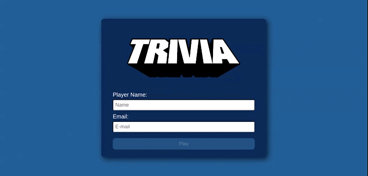

# Bem-vindo ao Projeto Trivia!

Este é um projeto da [Trybe](https://www.betrybe.com/) que foi desenvolvido em grupo no módulo de Front-end com o objetivo de exercitar e consolidar alguns conceitos de React, React Router e Redux.

## Algumas habilidades exercitadas

  - Criar um store Redux em aplicações React;

  - Criar reducers no Redux em aplicações React;

  - Criar actions no Redux em aplicações React;

  - Criar dispatchers no Redux em aplicações React;

  - Conectar Redux aos componentes React;

  - Criar actions assíncronas na aplicação React que faz uso de Redux;

  - Escrever testes para garantir que a aplicação possua uma boa cobertura de testes.

## O que foi desenvolvido

O Trivia é um jogo de perguntas e respostas. Com esta aplicação o usuário é capaz de:

  - Logar no jogo e, se o email tiver cadastro no site [Gravatar](https://pt.gravatar.com/), ter sua foto associada ao perfil da pessoa usuária;
  - Acessar a página referente ao jogo, onde se deverá escolher uma das respostas disponíveis para cada uma das perguntas apresentadas. A resposta deve ser marcada antes do contador de tempo chegar a zero, caso contrário a resposta é considerada errada;
  - Ser redirecionada, após 5 perguntas respondidas, para a tela de feedback, onde o texto mostrado depende do número de acertos;
  - Visualizar a página de ranking, se quiser, ao final de cada jogo;

## Prévia

